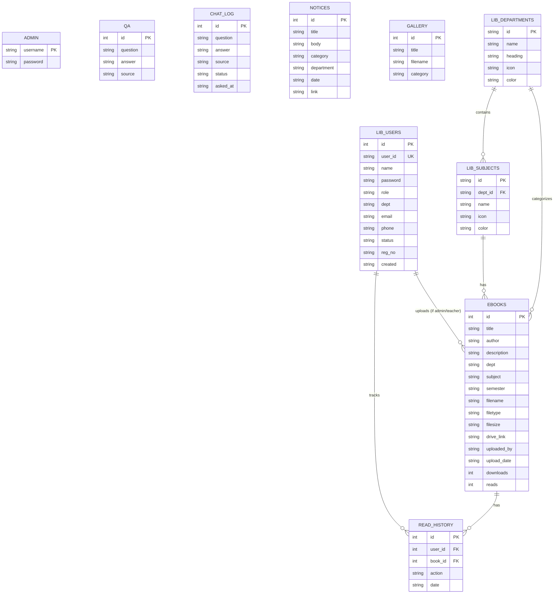

# Entity Relationship (ER) Diagram

This diagram represents the database schema of the Contai Nova College Management System.

```mermaid
erDiagram
    ADMIN {
        string username PK
        string password
    }
    
    QA {
        int id PK
        string question
        string answer
        string source
    }

    CHAT_LOG {
        int id PK
        string question
        string answer
        string source
        string status
        string asked_at
    }

    NOTICES {
        int id PK
        string title
        string body
        string category
        string department
        string date
        string link
    }

    GALLERY {
        int id PK
        string title
        string filename
        string category
    }

    LIB_USERS {
        int id PK
        string user_id UK
        string name
        string password
        string role
        string dept
        string email
        string phone
        string status
        string reg_no
        string created
    }

    EBOOKS {
        int id PK
        string title
        string author
        string description
        string dept
        string subject
        string semester
        string filename
        string filetype
        string filesize
        string drive_link
        string uploaded_by
        string upload_date
        int downloads
        int reads
    }

    READ_HISTORY {
        int id PK
        int user_id FK
        int book_id FK
        string action
        string date
    }

    LIB_DEPARTMENTS {
        string id PK
        string name
        string heading
        string icon
        string color
    }

    LIB_SUBJECTS {
        string id PK
        string dept_id FK
        string name
        string icon
        string color
    }

    %% Relationships
    LIB_USERS ||--o{ READ_HISTORY : "tracks"
    EBOOKS ||--o{ READ_HISTORY : "has"
    LIB_DEPARTMENTS ||--o{ LIB_SUBJECTS : "contains"
    LIB_DEPARTMENTS ||--o{ EBOOKS : "categorizes"
    LIB_SUBJECTS ||--o{ EBOOKS : "has"
    LIB_USERS ||--o{ EBOOKS : "uploads (if admin/teacher)"
```
