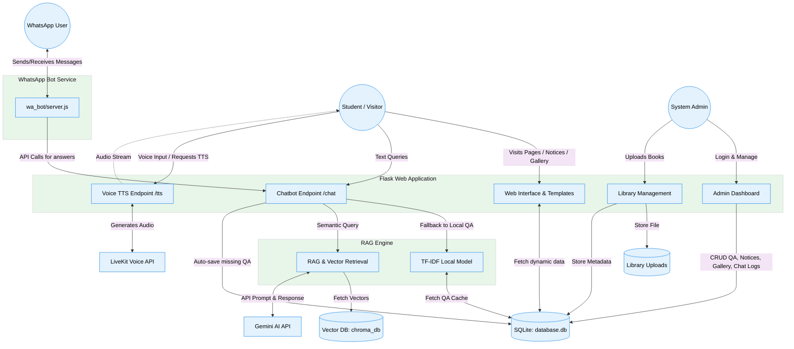
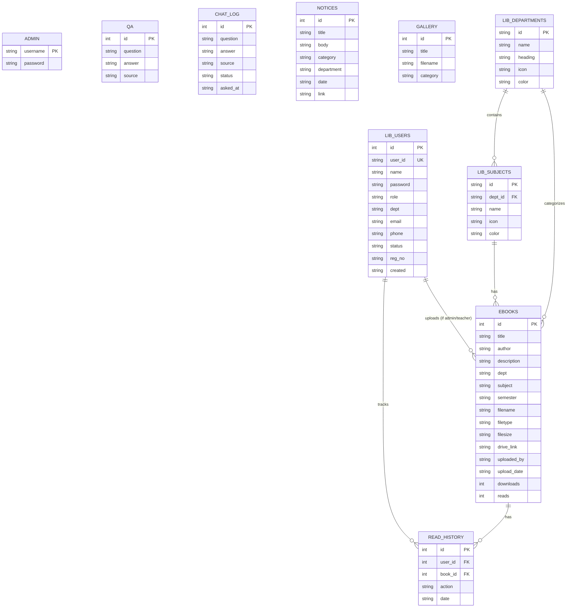

# College Web Portal Management & Digital Library System (AI Powered)

## Project Report

**Submitted To**
Contai Polytechnic
Department of Computer Science & Technology

**Submitted By**
Student Name: Swarup Dey
Roll: DCONCSTS4, No: 100033521
Registration No: D242533471
SEM- 4th
YEAR- 2026
Session: 2025-2026

**Guided By**
Project Guide Name: Gitanjali Mandal Ma’am
Academic Year: 2025–2026

---

## CERTIFICATE

This is to certify that the project entitled **“College Web Portal Management & Digital Library System (AI Powered)”** submitted by **Swarup Dey** of Computer Science & Technology Department, Contai Polytechnic, is a bonafide work carried out under the supervision of the undersigned during the academic session 2025–2026.

The work presented in this project report is original and has been completed successfully according to the requirements of the diploma curriculum.

   
**Project Guide Signature:** ____________________   
**Head of Department Signature:** ____________________

---

## ACKNOWLEDGEMENT

I would like to express my sincere gratitude to all the people who supported me during the development of this project. First of all, I thank our respected Principal and Head of the Department of Computer Science & Technology, Contai Polytechnic, for providing the opportunity and necessary facilities to complete this project successfully.

I would also like to thank my project guide for continuous guidance, valuable suggestions, and technical support throughout the development process. Their encouragement helped me to improve the project and complete it efficiently.

I am grateful to my teachers, friends, and classmates who helped me directly or indirectly during the development and testing of this project.

Finally, I would like to thank my family for their constant support and motivation.

---

## ABSTRACT

The **“College Web Portal Management & Digital Library System (AI Powered)”** is an advanced web-based platform developed for modern educational institutions. The system is designed to digitally manage important academic activities such as library management, student support, communication, and online information services through a single integrated portal.

The project combines multiple modern technologies including Artificial Intelligence (Google Gemini for RAG - Retrieval-Augmented Generation), Digital Library Management, WhatsApp Automation (Node.js), Voice TTS (LiveKit), and Virtual Campus Tour. The main purpose of the system is to provide students and teachers with easy access to educational resources and institutional information from anywhere through an internet connection.

The system allows administrators to manage books, users, notices, departments, gallery images, and academic resources through a secure admin dashboard. Students can search books department-wise, read PDF books online, download study materials, and interact with the AI-powered support system for quick information retrieval.

The WhatsApp integration module improves communication by automating notifications and updates for students. The responsive interface ensures smooth access from desktop, laptop, tablet, and mobile devices.

The entire project is developed using Flask (Python), HTML5, CSS3, JavaScript, SQLite Database, Chroma Vector Database, and Node.js technologies. The project demonstrates practical implementation of modern web technologies and provides a smart digital solution for colleges and educational institutions.

---

## INDEX

| Chapter No | Chapter Name |
| :--- | :--- |
| 1 | Introduction |
| 2 | Objective of the Project |
| 3 | Existing System |
| 4 | Proposed System |
| 5 | Feasibility Study |
| 6 | Software & Hardware Requirements |
| 7 | System Architecture & DFD |
| 8 | Database Design & ER Diagram |
| 9 | Modules Description |
| 10 | Working Procedure |
| 11 | AI & WhatsApp Integration |
| 12 | Advantages |
| 13 | Limitations |
| 14 | Future Scope |
| 15 | Testing |
| 16 | Conclusion |
| 17 | Bibliography |

---

## CHAPTER 1: INTRODUCTION

Technology has become one of the most important parts of modern education systems. Most colleges and educational institutions are now shifting from traditional manual systems to digital platforms in order to improve efficiency, communication, accessibility, and management. Manual systems consume more time, require excessive paperwork, and make academic resource management difficult.

The “College Web Portal Management & Digital Library System (AI Powered)” is developed to solve these problems by providing a centralized online platform for students, teachers, and administrators. The system simplifies academic activities and allows users to access educational resources quickly and efficiently.

This project integrates several advanced modules such as Digital Library Management, AI-powered Helpdesk (utilizing the Google Gemini API), WhatsApp Automation, Online PDF Reading System, Admin Dashboard, and Virtual Campus Tour into a single web application. The platform helps students access study materials online while allowing administrators to manage users, books, departments, and other institutional information.

The system is designed with a modern responsive user interface that works smoothly across different devices. By using this platform, institutions can reduce manual workload, improve communication, and enhance the overall learning experience for students.

The project mainly focuses on creating a practical, user-friendly, secure, and scalable solution for modern educational institutions.

---

## CHAPTER 2: OBJECTIVE OF THE PROJECT

The main objectives of the project are:
1. To create a centralized college management platform.
2. To develop a digital library system for students and teachers.
3. To provide online access to eBooks and study materials.
4. To integrate AI assistance (Gemini RAG) for smart information support.
5. To automate WhatsApp communication and notifications via Node.js.
6. To reduce manual work in managing academic resources.
7. To provide secure authentication and user management.
8. To improve accessibility and digital learning.
9. To provide a responsive and modern user interface.
10. To implement a practical real-world web application.

---

## CHAPTER 3: EXISTING SYSTEM

In many colleges, library and management activities are still handled manually. Traditional systems have several disadvantages:
- Books are maintained manually.
- Students must physically visit the library to access resources.
- Searching books takes an extensive amount of time.
- Communication with students is inefficient and often delayed.
- Manual record management is difficult and prone to errors.
- No online access to study materials.
- Data management becomes complicated as the volume of information grows.
- User tracking and reporting are severely limited.

Manual systems also increase paperwork and reduce overall efficiency. Students face difficulties accessing educational resources from remote locations. Because of these problems, there is a pressing need for a smart digital system that automates academic resource management.

---

## CHAPTER 4: PROPOSED SYSTEM

The proposed system is a smart web-based application that integrates various academic and management services into a single centralized platform. The system is specially designed for colleges and educational institutions to digitally manage academic resources, library operations, communication systems, and user activities.

The platform provides a modern Digital Library System where students and teachers can access study materials online. Users can search books by department, subject, or semester, read PDF books directly in the browser, and download materials whenever required.

The proposed system also includes an AI-powered helpdesk module that helps users retrieve information quickly and efficiently using advanced Natural Language Processing (via Google Gemini AI). Additionally, the WhatsApp automation system (Node.js) enables instant communication and notification delivery through WhatsApp Web integration.

The administrator can control the entire system through a secure dashboard. The admin panel provides facilities for uploading books, managing users, monitoring activities, managing departments, and controlling the communication system.

The project also contains a Virtual Campus Tour module which provides an interactive digital overview of the campus environment for students and visitors. Overall, the proposed system reduces paperwork, minimizes manual effort, improves communication efficiency, and provides a superior digital learning environment.

---

## CHAPTER 5: FEASIBILITY STUDY

A feasibility study assesses the practicality of the proposed system.

**1. Technical Feasibility:** 
The project utilizes proven and widely accessible technologies like Python (Flask), SQLite, Node.js, HTML/CSS/JS, and Google Gemini API. These technologies guarantee stable deployment and straightforward maintenance, making the project highly technically feasible.

**2. Operational Feasibility:**
The user interface is designed to be highly intuitive, meaning users require no special training to operate the portal. The automated chatbot and WhatsApp notifications drastically reduce administrative overhead, proving its operational viability.

**3. Economic Feasibility:**
Since the platform relies heavily on open-source libraries (Python, Node.js) and standard APIs, the cost of development and deployment is minimal. It provides exceptional value for modernizing the academic infrastructure without a heavy financial burden.

---

## CHAPTER 6: SOFTWARE & HARDWARE REQUIREMENTS

**Software Requirements**
| Software | Purpose |
| :--- | :--- |
| **Python 3.x** | Backend Development |
| **Flask** | Web Framework |
| **HTML5, CSS3** | Structure & Styling of Web Pages |
| **JavaScript** | Dynamic Functionality |
| **SQLite & Chroma DB** | Database Management (Relational & Vector) |
| **Node.js** | WhatsApp Bot Integration |
| **VS Code** | Code Editor |
| **Git** | Version Control |
| **Google Gemini API** | AI RAG Engine |
| **LiveKit API** | Voice TTS Integration |

**Hardware Requirements**
| Hardware | Specification |
| :--- | :--- |
| **Processor** | Intel i3 / AMD Ryzen 3 or above |
| **RAM** | Minimum 4GB (8GB recommended) |
| **Storage** | 20GB Free Space |
| **Internet** | Required for AI, Voice, and WhatsApp features |
| **Operating System**| Windows / Linux / macOS |

---

## CHAPTER 7: SYSTEM ARCHITECTURE & DFD

The project follows a modular, client-server architecture separating the frontend, backend, database, and AI engine for robust performance.

### Data Flow Diagram (DFD)

---

## CHAPTER 8: DATABASE DESIGN & ER DIAGRAM

The system uses an **SQLite database** for transactional data (Users, Books, Notices, Chat Logs, QA) and **ChromaDB** for semantic vectors.

### Entity Relationship (ER) Diagram

---

## CHAPTER 9: MODULES DESCRIPTION

**1. Home Page Module**
Provides an overview of the system, announcements, and navigation options. Features responsive design, navigation menu, college information, department links, and AI helpdesk access.

**2. Login & Authentication Module**
Handles secure user logins using role-based access control (Student, Teacher, Admin), password protection, and session management.

**3. Digital Library Module**
One of the core features of the system. Allows uploading eBooks, reading books via an online PDF reader, downloading, and advanced searching (by department, semester, subject).

**4. Admin Dashboard Module**
Provides system control to administrators. Features user/book management, activity monitoring, statistics dashboard, QA injection, and notice updates.

**5. AI Helpdesk Module**
Employs Google Gemini AI in a Retrieval-Augmented Generation (RAG) setup. Provides smart responses to user queries by retrieving context from local databases before passing to the AI for formulation.

**6. WhatsApp Bot Module**
Automates communication using a Node.js script. Features QR authentication, automated notifications, and natural language query responses over WhatsApp by communicating with the Flask backend.

**7. Virtual Tour Module**
Provides a 3D or digital overview of the campus, greatly enhancing the visitor and student experience before physically visiting the campus.

---

## CHAPTER 10: WORKING PROCEDURE

1. **Access**: User opens the web application via browser.
2. **Authentication**: User logs into the system (verified against SQLite by Flask).
3. **Dashboard Navigation**: User accesses the dashboard to browse resources.
4. **Library Operations**: Students search for books by department/subject and can either read them via the integrated browser PDF viewer or download them.
5. **Administration**: The Admin logs into the backend to manage notices, gallery images, QA datasets, and user credentials.
6. **AI Querying**: A user interacts with the Chatbot widget. The `rag_engine.py` processes the query, performs semantic search over `ChromaDB`, and sends context to Gemini for a smart response.
7. **WhatsApp Communication**: The background `wa_bot` running on Node.js listens for incoming messages on a linked WhatsApp account, queries the Flask chatbot endpoint, and replies automatically to students.

---

## CHAPTER 11: AI & WHATSAPP INTEGRATION

**AI Integration (Gemini & RAG)**
The project uses a sophisticated Retrieval-Augmented Generation (RAG) pipeline.
- It parses HTML/PDF text and stores embeddings inside `ChromaDB`.
- When a query is asked, it retrieves the top matched vectors or uses a local TF-IDF model as a fallback.
- Context is supplied to the `Google Gemini API`, producing highly accurate, college-specific answers without hallucinating general internet data.
- Additionally, Voice Text-to-Speech (TTS) is handled via LiveKit for an interactive experience.

**WhatsApp Integration**
The Node.js based WhatsApp automation interacts seamlessly with the Flask application.
- Uses `whatsapp-web.js` for QR-based authentication.
- Automatically handles student queries remotely.
- Broadcasts important notifications to students.
- Restarts itself securely using child process management in Flask (`_start_wa_bot()` routine) if it crashes.

---

## CHAPTER 12: ADVANTAGES

1. Provides easy online access to educational resources and study materials.
2. Reduces manual paperwork and administrative workload.
3. Saves time for both students and administrators.
4. Offers a modern and responsive user interface for a premium user experience.
5. Centralizes all important college services into a single platform.
6. Radically improves communication through WhatsApp automation.
7. AI-powered support prevents redundant support queries and gives instant accurate info.
8. Secure role-based login and user authentication.
9. Interactive Virtual Campus Tour appeals to prospective students.
10. Scalable backend allows for future improvements and additional modules.

---

## CHAPTER 13: LIMITATIONS

1. **Storage Dependency**: Heavy reliance on local file system for eBooks means a larger server storage requirement over time.
2. **Internet Necessity**: Advanced features like Gemini AI and WhatsApp require constant internet connectivity.
3. **Database Constraints**: SQLite is perfect for current scale but may face concurrency issues if scaled to thousands of simultaneous writes.
4. **WhatsApp Session Maintenance**: The WhatsApp Web session occasionally requires re-scanning the QR code if the host device disconnects.

---

## CHAPTER 14: FUTURE SCOPE

The project serves as a foundational platform and can be expanded by adding:
- Online Admission & Fees Payment System (Payment Gateway Integration).
- Automated Attendance Management.
- Online Examination & Quiz Modules.
- Cloud Deployment (AWS, Heroku) with PostgreSQL for higher scalability.
- Face Recognition for seamless student authentication.
- A dedicated Mobile Application wrapping the web interface.
- Advanced Analytics Dashboard using machine learning to track student performance trends.

---

## CHAPTER 15: TESTING

Ensuring system reliability was done through several testing methodologies:
1. **Unit Testing**: Testing individual components like RAG logic (`rag_engine.py`) and Database logic independently.
2. **Integration Testing**: Verifying the communication between Flask (Python) and WhatsApp Bot (Node.js).
3. **UI/UX Testing**: Guaranteeing the responsive design works identically across Chrome, Firefox, mobile, and tablet viewports.
4. **Database Testing**: Verifying integrity during CRUD operations on SQLite.
5. **Security Testing**: Checking password hashing (SHA256/Bcrypt) and session handling to prevent unauthorized access.

---

## CHAPTER 16: CONCLUSION

The **“College Web Portal Management & Digital Library System (AI Powered)”** successfully fulfills its core objectives by providing a smart, modern, and highly efficient digital platform for educational institutions. 

By integrating cutting-edge technologies—such as Google Gemini Artificial Intelligence, RAG based Semantic Search, Node.js WhatsApp Automation, Voice TTS, and a robust MVC Flask Backend—the application simplifies complex academic management and dramatically improves the accessibility of educational resources.

The admin panel guarantees tight control over the ecosystem, while the AI chatbot and automated messaging redefine how institutions communicate with their students. The project is a prime example of practical, scalable implementation of modern software development, demonstrating a significant leap from traditional paperwork to a digital, intelligent campus.

---

## CHAPTER 17: BIBLIOGRAPHY

**Websites**
1. Flask Documentation - https://flask.palletsprojects.com/
2. Python Official Site - https://www.python.org/
3. MDN Web Docs - https://developer.mozilla.org/
4. Node.js Official Site - https://nodejs.org/
5. SQLite Documentation - https://www.sqlite.org/
6. W3Schools (HTML/CSS) - https://www.w3schools.com/
7. Google Gemini API Docs - https://ai.google.dev/

**Books**
1. *Web Development using Python and Flask*
2. *Database Management Systems*
3. *HTML & CSS Web Design*
4. *JavaScript Programming Guide*
