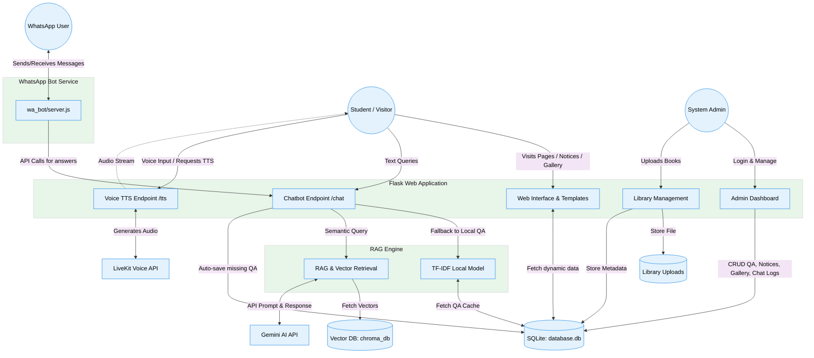

# College Management & AI System - Data Flow Diagram (DFD)

This is the system architecture and data flow diagram for the Contai Nova College application.

```mermaid
%%{init: {'theme': 'base', 'themeVariables': { 'primaryColor': '#e3f2fd', 'primaryTextColor': '#000', 'primaryBorderColor': '#1e88e5', 'lineColor': '#333', 'secondaryColor': '#f3e5f5', 'tertiaryColor': '#e8f5e9'}}}%%
graph TD
    %% External Entities
    User((Student / Visitor))
    Admin((System Admin))
    WAUser((WhatsApp User))
    Gemini[Gemini AI API]
    LiveKit[LiveKit Voice API]

    %% Main Processes
    subgraph Web Application [Flask Web Application]
        UI[Web Interface & Templates]
        ChatAPI[Chatbot Endpoint /chat]
        VoiceAPI[Voice TTS Endpoint /tts]
        AdminPanel[Admin Dashboard]
        LibraryMgr[Library Management]
    end

    subgraph AI Core [RAG Engine]
        TFIDF[TF-IDF Local Model]
        RAG[RAG & Vector Retrieval]
    end

    subgraph Node Server [WhatsApp Bot Service]
        WABot[wa_bot/server.js]
    end

    %% Data Stores
    DB[(SQLite: database.db)]
    Chroma[(Vector DB: chroma_db)]
    Ebooks[(Library Uploads)]

    %% Data Flows - User Interactions
    User -->|Visits Pages / Notices / Gallery| UI
    User -->|Text Queries| ChatAPI
    User -->|Voice Input / Requests TTS| VoiceAPI
    
    %% Data Flows - WhatsApp
    WAUser <-->|Sends/Receives Messages| WABot
    WABot -->|API Calls for answers| ChatAPI

    %% Data Flows - Chatbot Logic
    ChatAPI -->|Fallback to Local QA| TFIDF
    ChatAPI -->|Semantic Query| RAG
    RAG -->|Fetch Vectors| Chroma
    RAG <-->|API Prompt & Response| Gemini
    TFIDF <-->|Fetch QA Cache| DB

    %% Data Flows - Voice
    VoiceAPI <-->|Generates Audio| LiveKit
    VoiceAPI -.->|Audio Stream| User

    %% Data Flows - Admin
    Admin -->|Login & Manage| AdminPanel
    Admin -->|Uploads Books| LibraryMgr
    AdminPanel -->|CRUD QA, Notices, Gallery, Chat Logs| DB
    LibraryMgr -->|Store File| Ebooks
    LibraryMgr -->|Store Metadata| DB

    %% Data Flows - Internal storage
    ChatAPI -->|Auto-save missing QA| DB
    UI <-->|Fetch dynamic data| DB
```
